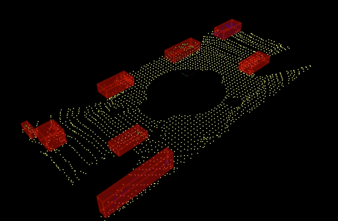
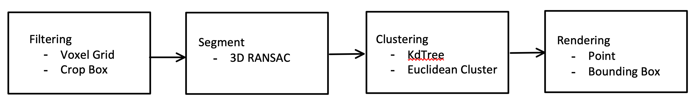
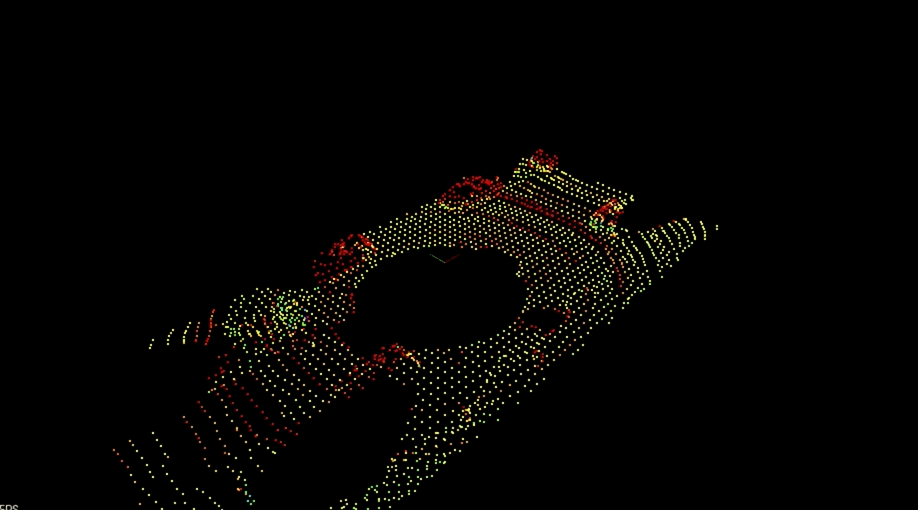
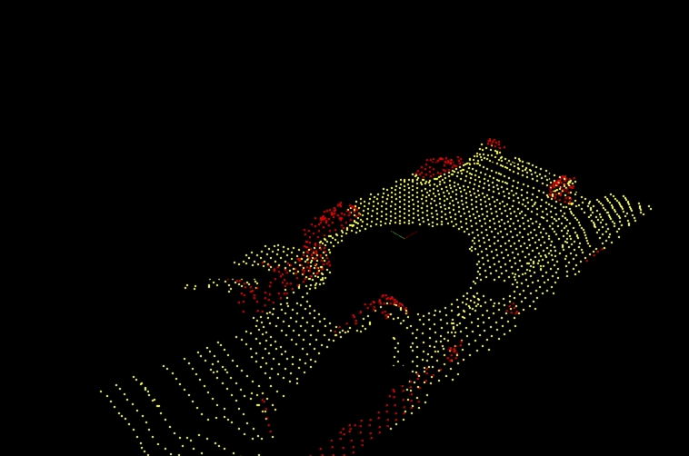
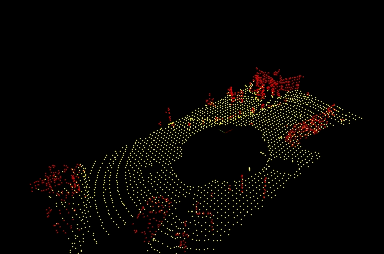
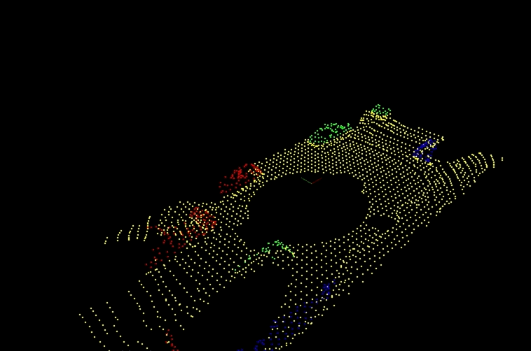
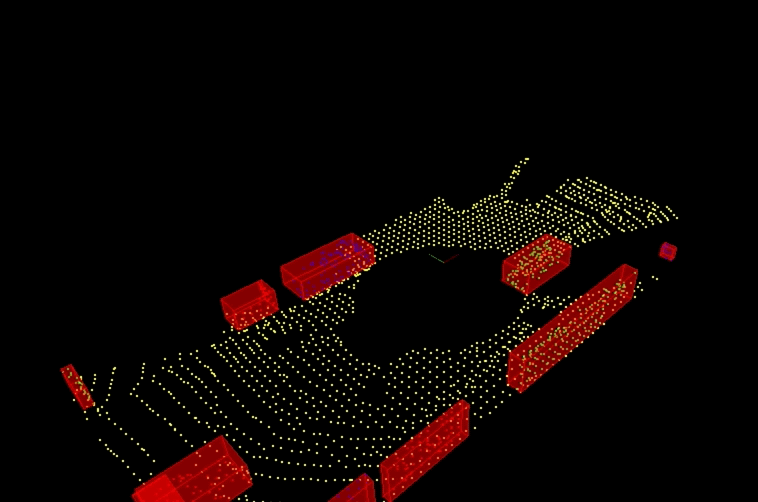
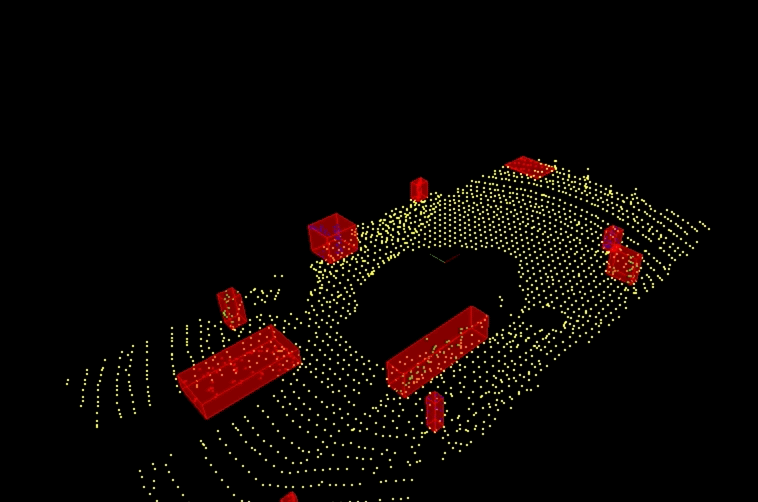

# Processing the LiDAR Point Cloud with PCL

## Result

|                      Data 1                       |                      Data 2                       |
| :-----------------------------------------------: | :-----------------------------------------------: |
|  |  |

## Pipe Line



## Visualization step by step

1. Raw Data
   | Data 1 | Data 2 |
   | :-------------------------------------------------------------: | :-------------------------------------------------------------: |
   |  |  |
2. Filtering
   | Data 1 | Data 2 |
   | :-------------------------------------------------------------: | :-------------------------------------------------------------: |
   |  |  |
3. Segment
   | Data 1 | Data 2 |
   | :-------------------------------------------------------------: | :-------------------------------------------------------------: |
   |  |  |
4. Clustering
   | Data 1 | Data 2 |
   | :-------------------------------------------------------------: | :-------------------------------------------------------------: |
   |  |  |
5. Rendering
   | Data 1 | Data 2 |
   | :-------------------------------------------------------------: | :-------------------------------------------------------------: |
   |  |  |

## Workspace

-   Ubuntu 16.04
-   PCL - v1.7.2
-   C++ v14

1. Install and Run docker desktop

    - [Install Docker](https://www.docker.com/products/docker-desktop)
    - Run docker destkop

2. Pull the image and make the container from kimjw7981/SFND_lidar

    - Check out this page [kimjw7981/SFND_lidar Docker Hub](https://hub.docker.com/repository/docker/kimjw7981/sfnd)
    - Run this command for pull the image and make the container
        ```shell
        docker run -p 6080:80 -v /dev/shm:/dev/shm kimjw7981/sfnd
        ```
    - Connect the linux GUI environment with [localhost:6080](localhost:6080) on your browser

3. Run LX Terminal

4. Execute the following commands in LX Terminal

    ```shell
    sudo apt update -y && sudo apt upgrade -y
    cd ~/SFND_Lidar_Obstacle_Detection
    mkdir build && cd build
    cmake ..
    make
    ./environment
    ```

5. Done
    - Take your time to learn the Sensor Fusion Nanodegree Program

#### Build from Source

[PCL Source Github](https://github.com/PointCloudLibrary/pcl)

[PCL Mac Compilation Docs](https://pcl.readthedocs.io/projects/tutorials/en/latest/compiling_pcl_macosx.html#compiling-pcl-macosx)
